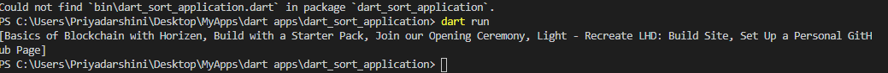

A sample command-line application with an entrypoint in `bin/`, library code
in `lib/`
## output

Created from templates made available by Stagehand under a BSD-style
[license](https://github.com/dart-lang/stagehand/blob/master/LICENSE).
